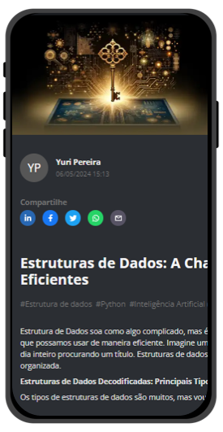

# Projeto Artigo Técnico gerado por I.A.s

 > ℹ️ **NOTE:** Este repositório foi desenvolvido durante o curso Santander 2024 - Fundamentos de IA para Devs da [DIO](https://dio.me) no qual [Felipe Silva Aguiar](https://github.com/felipeAguiarCode) foi instrutor técnico.

Projeto com o objetivo de gerar um artigo técnico com um layout rico, leitura agradável e com foco em promover autoridade técnica.

<a href="https://dio.me/articles/estruturas-de-dados-a-chave-secreta-para-algoritmos-mais-eficientes" title="View Article now"> 📕Clique aqui para ler o artigo</a>

## 💻 Tecnologias utilizadas no projeto

- [ChatGPT](https://chat.openai.com/)
- [Dall-e (Chatgpt)](https://openai.com/index/dall-e-2)
- [PowerPoint](https://www.microsoft.com/en/microsoft-365/powerpoint)

## 🧠 Prompts

ChatGPT：

|   Ação   | prompt                                                                                                                                                                                                                                                                         |
| :------: | ------------------------------------------------------------------------------------------------------------------------------------------------------------------------------------------------------------------------------------------------------------------------------ |
|  título  | Crie 10 headlines para nomes de artigos sobre o assunto Estrutura de Dados |
| conteúdo | Comporte-se como um escritor de artigos tech senior e escreva um artigo atendendo as regras abaixo. {REGRAS} > No máximo 5 linhas por bloco de explicação > Me explique de maneira informal, como se estivesse ensinando alguém que não conhece programação > Os blocos que serão criados estão abaixo: - O que é Estrutura de Dados - Cite todos os tipos de Estruturas de Dados (vetores, tabelas, pilhas, mapas, listas, filas, conjuntos e árvore) - Exemplo de código em Python, dando exemplos de aplicação prática em projetos reais e que fazem sentido - Por que é importante usar estrutura de dados e como se relaciona com algoritmos - Faça um call to action para as minhas redes sociais - Coloque 3 hashtags que façam sentido |

Dall-e (Chatgpt)：

|  Ação  | prompt                                                                                 |
| :----: | -------------------------------------------------------------------------------------- |
| Capa | Gere uma capa para artigo sobre o tema: "Estruturas de Dados: A Chave Secreta para Algoritmos Mais Eficientes" |

## ✨ Features

- Conteúdo gerado via ChatGPT
- Imagens geradas via Dall-e

## 📚 Materiais

- Imagens utilizadas em `assets`

## 🛠️ Instruções de execução

Utilize os prompts acima nas ferramentas sugeridas para gerar o material base e utilize uma ferramenta de edição de documentos como power point, libreoffice , indesign para diagramação.

## 👨‍💻 Desenvolvedor

    
      

        
&nbsp&nbspYuri Dias 
        &nbsp&nbsp&nbsp
    

 

     
